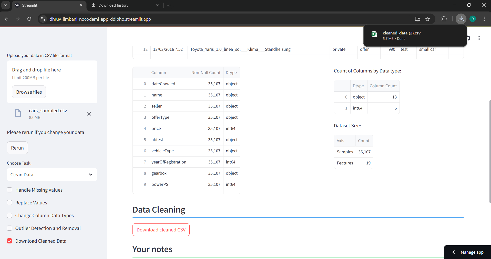
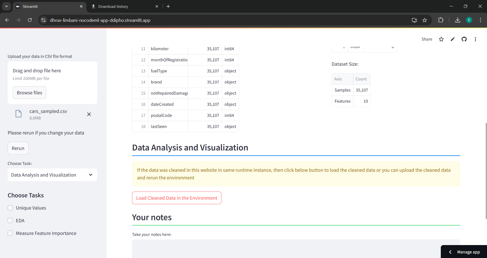

# No-Code Machine Learning Model Building Platform

Welcome to the No-Code ML Model Building Platform! This platform enables users to perform data cleaning, transformation, visualization, and machine learning model building without writing any code.

## Features

### 1. Data Upload and Display
- Upload your dataset in CSV format.
- View and explore the data directly in the app.


### 2. Data Cleaning
- Handle missing values:
  - Drop rows with missing values.

    

  - Impute missing values using mean, median, or mode.
    
    

- Replace values in columns.

    

- Change column data types.
    
    

- Detect and remove outliers using:
  - Interquartile Range (IQR)
  - Z-Score

  

- Download Cleaned Data as CSV:

  


### 3. Data Analysis and Visualization



- **Unique Values**: Explore unique values for selected columns.

    

- **EDA (Exploratory Data Analysis):**
  - Univariate Analysis: Visualize single-variable distributions.

    

  - Bivariate Analysis: Analyze relationships between two variables.

    

  - Multivariate Analysis: Correlation matrix and heatmaps.

    

- **Feature Importance:**
  - Calculate feature importance using methods like Random Forest, Chi-Square, ANOVA F-value, Point Biserial Correlation, and Mutual Information.

    

    

### 4. Data Preparation for Modeling
- Drop irrelevant columns.

    

- Split data into train and test sets.

    

- Normalize numerical data and encode categorical data using:
  - Label Encoding
  - One-Hot Encoding
  - Ordinal Encoding
  - Standard Scaling
  - Min-Max Scaling

    

- Handle class imbalance (coming soon).
- Perform dimensionality reduction (coming soon).

    

### 5. Machine Learning Model Building
- **Model Training:**
  - Choose between classification or regression tasks.
  - Supported algorithms include Logistic Regression, Random Forest, Gradient Boosting, Support Vector Machines, and more.

    

- **Model Testing:**
  - Evaluate trained models on test data.
  - Download trained models as pickle files.

    

### 6. Notes and Downloads
- Take notes directly in the app.
- Download cleaned data, transformed data, models, and notes.

## Getting Started
1. Clone the repository:

   ```bash
   git clone https://github.com/Dhruv-Limbani/NoCodeML.git
   ```
2. Install the required Python dependencies:

   ```bash
   pip install -r requirements.txt
   ```
3. Run the app:

   ```bash
   streamlit run app.py
   ```
4. Open the app in your browser and upload your data to get started.

---